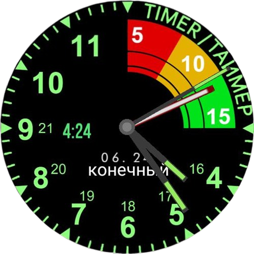
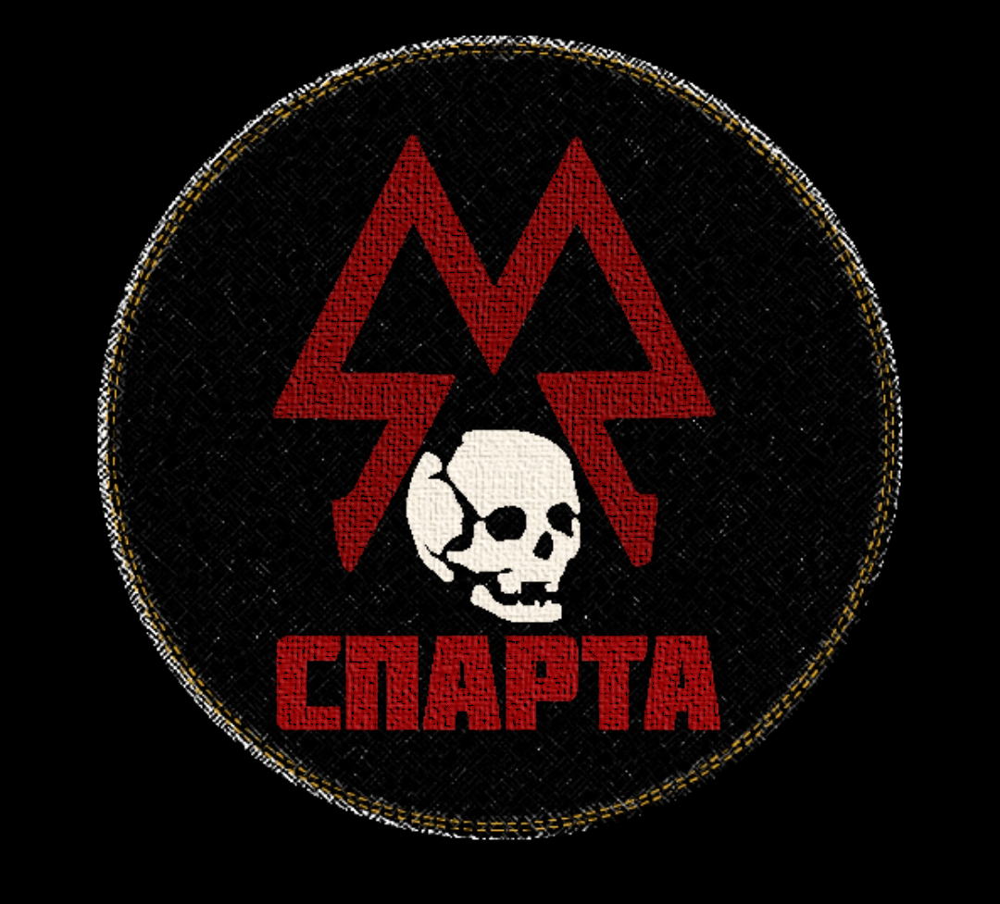
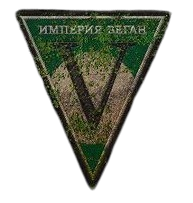

<!-- ☢️ BANNER -->

<p align="center">
  
</p>

<h1 align="center">
  
  MARKEIS24
</h1>
<h3 align="center">SYSTEM INTERFACE • BACKEND OPERATOR</h3>

---

<table>
<tr>

<td width="50%" valign="top">

<h2>
  
  OPERATOR
</h2>

<p align="center">
  
</p>

```
NAME: Giovanna Marques
CLASS: Backend Developer
LEVEL: Junior
STATUS: ONLINE
LOCATION: Brazil
```

---

<h2>
  
  ARSENAL
</h2>

<p>
  
</p>

---

<h2>
  
  MISSIONS
</h2>

```
> Secure a development internship
> Constantly evolve
> Build efficient solutions
```

---

<h2>
  
  FACTION
</h2>

<p align="center">
  
</p>

[ SPARTAN RANGERS ]

Elite unit

Focus on discipline, strategy, and resilience.

---

<p align="center">
  
</p>
<p align="center">
  
</p>

</td>

<td width="50%" valign="top">

<h2>
  
  SYSTEM DATA
</h2>

``` id="sysdata01"
[ SYSTEM CORE ONLINE ]

USER: Markeis24
ROLE: Backend Developer
FOCUS: Java | SQL | APIs

CPU LOAD: ███████░░░ 70%
DATABASE: ██████████ 100%
API STATUS: ████████░░ 80%

LANGUAGES:
JAVA       █████████░ 90%
SQL        ████████░░ 80%
HTML/CSS   ██████░░░░ 60%
```

---

<h2>
  
  ACTIVITY
</h2>

<p align="center">
  
</p>

---

<h2>
  
  FIELD OPERATIONS
</h2>

```
[✔] Fleet Management System
     → Controle de uso e consumo de viaturas

[✔] Analytical Dashboard
     → Comparação e análise de dados estratégicos

[✔] SQL Deep Studies
     → Joins, agregações e performance
```

---

<h2>
  
  SYSTEM LOG
</h2>

<p align="center">
  
</p>

<p align="center">
  
</p>

---

<h2>
  
  ACHIEVEMENTS
</h2>

``` id="achv01"
[ UNLOCKED ]

✔ First Backend Project
✔ SQL Advanced Queries
✔ Dashboard Implementation
✔ API Development

NEXT:
[ ] Deploy Full System
[ ] First Internship
```

</td>

</tr>
</table>

---

<h2>
  
  FINAL TRANSMISSION
</h2>

<p align="center">
  
</p>

---

<h2>
  
  CONTACT
</h2>

```
EMAIL: giovannamrodrigues2006@gmail.com
LINKEDIN: www.linkedin.com/in/giovanna-marques-221998397
```
