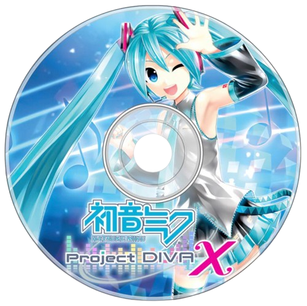
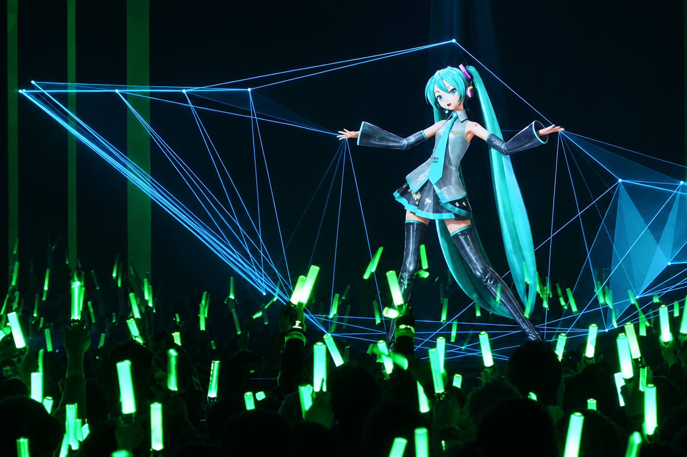

  

<h1 align="center">
  
  GIOVANNA MARQUES
</h1>

<h3 align="center">
  PROJECT DIVA // DIGITAL DEVELOPER PROFILE
</h3>

  
  
  

---

<table>
<tr>

<td width="50%" valign="top">

<h2>
  
  PLAYER PROFILE
</h2>

  

<pre>
PLAYER NAME : Markeis24
NAME        : Giovanna Marques
CLASS       : Backend Developer
LEVEL       : Junior
LOCATION    : Brazil
STATUS      : ONLINE
</pre>

---

<h2>
  
  MODULE SELECT
</h2>

  

  

  
  
  

---

<h2>
  
  PLAYER GOALS
</h2>

<pre>
♪ Build efficient backend systems

♪ Improve database architecture

♪ Develop real-world solutions

♪ Keep learning and evolving

♪ Turn ideas into working systems
</pre>

---

<h2>
  
  FAVORITE TRACK
</h2>

  

  <b>HATSUNE MIKU // PROJECT DIVA</b>

</td>

<td width="50%" valign="top">

<h2>
  
  PERFORMANCE DATA
</h2>

<pre>
┌─────────────────────────────┐
│       PLAYER STATUS         │
├─────────────────────────────┤
│                             │
│  BACKEND        ████████░░  │
│  DATABASE       █████████░  │
│  JAVA           ████████░░  │
│  SQL            █████████░  │
│  API            ████████░░  │
│                             │
│  ♪ COOL                     │
│  ♪ FINE                     │
│  ♪ SAFE                     │
│                             │
└─────────────────────────────┘
</pre>

---

<h2>
  
  TRACK SELECT
</h2>

<pre>
01 ─────────────────────────────

♪ FLEET MANAGEMENT SYSTEM

   JAVA / SPRING BOOT / SQL

   Vehicle usage and fuel
   consumption tracking.

02 ─────────────────────────────

♪ ANALYTICAL DASHBOARD

   JAVA / SQL / DATA

   Comparative analysis and
   strategic data insights.

03 ─────────────────────────────

♪ SQL DEEP STUDIES

   ORACLE / MYSQL

   Joins, aggregations and
   database optimization.
</pre>

---

<h2>
  
  LIVE EVENT
</h2>

<pre>
┌─────────────────────────────┐
│       CURRENT EVENT         │
├─────────────────────────────┤
│                             │
│  COMPANY                    │
│  Tudo de Bicho              │
│                             │
│  ROLE                       │
│  IT Intern                  │
│                             │
│  STATUS                     │
│  ● ACTIVE                   │
│                             │
│  FIELD                      │
│  IT / AUTOMATION            │
│                             │
└─────────────────────────────┘
</pre>

</td>

</tr>
</table>

---

<h2 align="center">
  
  GITHUB PERFORMANCE
</h2>

  

---

<h2 align="center">
  
  UNLOCKED
</h2>

---

<h2>
  
  CURRENT PLAYLIST
</h2>

<pre>
[ NOW PLAYING ]

♪ Java
♪ Spring Boot
♪ SQL
♪ Database Architecture
♪ REST APIs
♪ Automation
♪ Data Analysis

──────────────────────────────

NEXT TRACK

♪ Data Science
♪ Advanced Backend
♪ Cloud
♪ System Architecture
</pre>

---

<h2 align="center">
  
  CONTRIBUTION PERFORMANCE
</h2>

  

---

<h2 align="center">
  
  FINAL PERFORMANCE
</h2>

  

  

---

<h2 align="center">
  
  CONNECT
</h2>

  ♪ THANK YOU FOR PLAYING ♪

